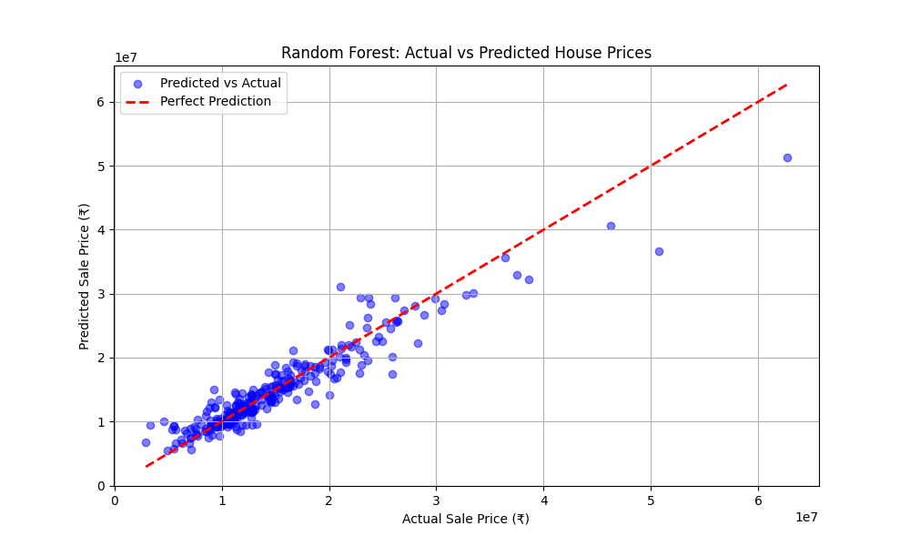

# 🏡 House Price Prediction System 



## 📌 Project Overview
The House Price Prediction System is an end-to-end Machine Learning web application designed to estimate real estate property values based on historical data. By inputting property features such as Lot Area, Overall Quality, and Year Built, users receive an instant market valuation powered by a trained Random Forest model.

This project serves as a comprehensive demonstration of the full Data Science and Machine Learning lifecycle: from data cleaning and feature engineering to model training, API deployment, and frontend integration.

## 🎯 Problem Statement & Industry Relevance
In the real estate market, manual property valuation is slow, subjective, and prone to human error. Pricing a house too high deters buyers, while pricing it too low results in financial loss. 
- **Prop-Techs (Zillow, Redfin):** Use automated valuation models (AVMs) for instant online estimates.
- **Banks:** Use predictive models for mortgage underwriting and risk assessment.
- **Brokers:** Leverage data-driven pricing to suggest competitive listing prices.

This project solves the valuation problem by applying machine learning to historical sales data to predict objective, data-driven prices.

## 🛠 Tech Stack
- **Data Science & ML:** Python, Pandas, Scikit-learn, Numpy
- **Data Visualization:** Matplotlib, Seaborn
- **Backend / API:** FastAPI, Uvicorn
- **Frontend:** Next.js, React, TailwindCSS
- **Modeling:** Random Forest Regressor & Decision Tree Regressor

## 📊 Dataset & Features
The model is trained on the Kaggle *House Prices: Advanced Regression Techniques* dataset. Key features used for inference include:
- `LotArea`: Lot size in square feet.
- `OverallQual`: Rates the overall material and finish of the house (1-10).
- `YearBuilt`: Original construction date.
- `TotalBsmtSF`: Total square feet of basement area.
- `GrLivArea`: Above grade (ground) living area square feet.
- `FullBath`: Full bathrooms above grade.
- `BedroomAbvGr`: Bedrooms above grade.
- `GarageCars`: Size of garage in car capacity.

## 📈 Results & Evaluation
We compared multiple models. The **Random Forest Regressor** outperformed the Decision Tree baseline.
- **R² Score:** ~0.89 (Captures 89% of the variance in house prices)
- **Mean Absolute Error (MAE):** ~₹15,37,990
- **Root Mean Squared Error (RMSE):** ~₹23,80,440

*See `images/feature_importance.png` for a visual breakdown of the most impactful predictors.*

## 🚀 How to Run the Project Locally

### 1. Clone the Repository
```bash
git clone https://github.com/your-username/House-Price-Prediction.git
cd House-Price-Prediction
```

### 2. Backend & ML Setup (FastAPI)
Create a virtual environment and install dependencies:
```bash
python -m venv env
env\Scripts\activate
pip install -r requirements.txt
```

*(Optional) Retrain the model:*
```bash
python src/train.py
```

*Start the FastAPI server:*
```bash
python -m uvicorn serving.app:app --reload --port 8000
```
The API will be live at `http://localhost:8000/docs`

### 3. Frontend Setup (Next.js)
Open a new terminal and navigate to the `web` folder:
```bash
cd web
npm install
npm run dev
```
The application will be live at `http://localhost:3000`. 

## 📸 Screenshots
*(Upload your screenshots to the `images/` folder and replace these links)*
- **Data Visualization:** `images/actual_vs_predicted.png`
- **Feature Importance:** `images/feature_importance.png`
- **Web App:** `images/webapp.png`

## 📚 Learning Outcomes
Through this project, I gained hands-on experience with:
- **Data Cleaning & Imputation:** Handling missing values in messy datasets.
- **Model Selection & Tuning:** Comparing tree-based regression models.
- **MLOps & Deployment:** Serializing models with Joblib and serving them via REST API.
- **Full-Stack Integration:** Connecting a React frontend to a Python ML backend.
